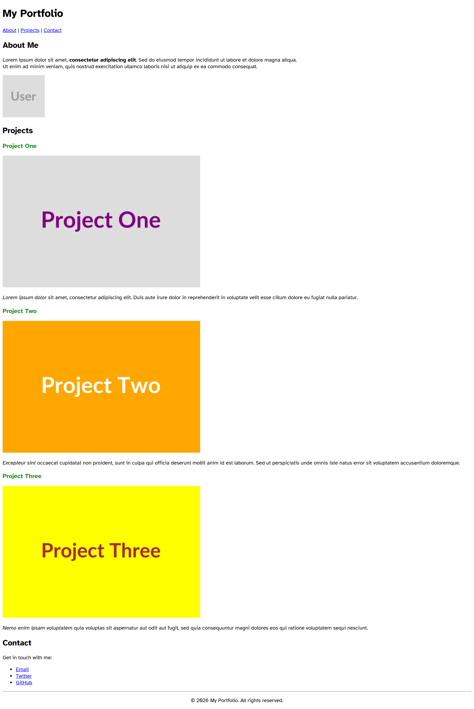
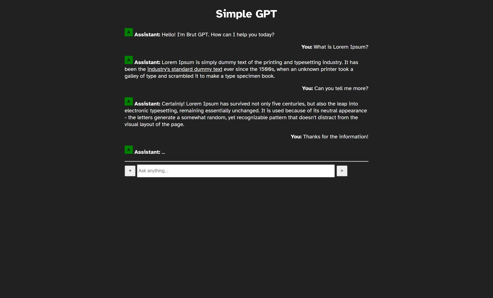
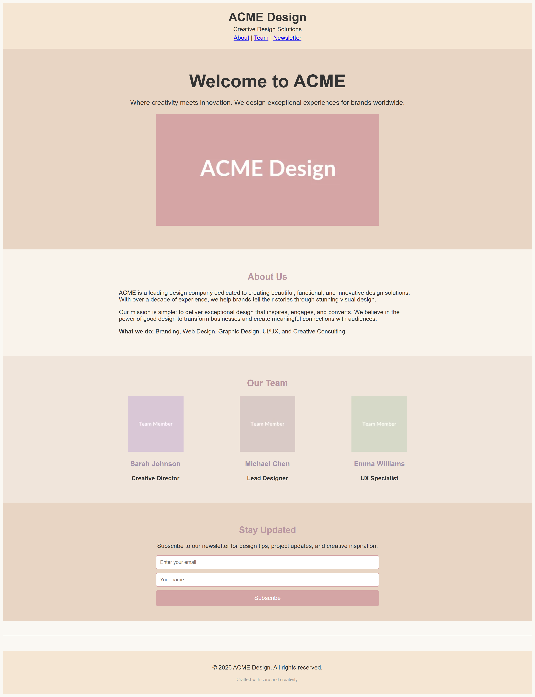

# HTML & JavaScript Coding Assignments

The assignments increase in difficulty, starting with a basic portfolio and ending with a styled company landing page.

---

## Assignment 1: Personal Portfolio (Level: Easy)

Build a single-page personal portfolio. The goal is to focus on **Semantic HTML** structure.

### Requirements:
- **Navigation:** Create a header with a title and links to "About", "Projects", and "Contact" using an `<a>` tag.
- **Content Sections:** 
    - Use `<section>` tags for each main part of the page.
    - An **About** section with a profile picture and a paragraph of "Lorem Ipsum" text.
    - A **Projects** section with at least three `<article>` elements. Each article should contain a title, a project image, and a description.
- **Styling:** Use a few inline `style` attributes to change the color of project titles (e.g., `color: forestgreen`).
- **Assets:**
    - Profile Image: `https://placehold.co/128x128/webp?text=User`
    - Project Images: `https://placehold.co/600x400/acqua/purple/webp?text=Project+One` (vary colors for others).

### Preview:

---

## Assignment 2: SimpleGPT Chat Interface (Level: Medium)

Create a simplified chat interface that mimics an LLM (Large Language Model) conversation. This assignment focuses on **Layout** and **Simple Interactivity**.

### Requirements:
- **Dark Mode UI:** Use inline styles on the `<body>` to set a dark background (`#212121`) and white text (`#ffffff`).
- **Chat History:** 
    - Create a container for messages.
    - Use `text-align: right` for "User" messages and default alignment for "Assistant" messages.
    - Add small avatar images for the assistant.
- **Input Area:** 
    - A text `<input>` for typing messages.
    - A button with the value `>` to "send" the message.
- **JavaScript Functionality:**
    - Write a function `sendMessage()`.
    - When the `>` button is clicked, it should read the value of the input and display it in a browser `alert(message)`.
- **Assets:**
    - Assistant Avatar: `https://placehold.co/24x24/green/black/webp?text=A`

### Preview:

---

## Assignment 3: ACME Design Landing Page (Level: Hard)

Create a professional landing page for "ACME Design," a creative agency. This assignment focuses on **Advanced Layouts** and **DOM Manipulation**.

### Requirements:
- **Design Theme:** Use a "Pastel" color palette.
    - Background: `#faf8f3`
    - Header/Footer: `#f5e6d3`
    - Buttons/Accents: `#d4a5a5`
- **Sections:**
    - **Hero Section:** A large centered heading, a subtitle, and a wide hero image.
    - **Team Section:** Display three team members side-by-side using `display: inline-block` and a width of roughly `30%`.
    - **Newsletter Form:** A section with two inputs (Name and Email) and a "Subscribe" button.
- **JavaScript Functionality:**
    - Create a function `handleNewsletterSubmit()`.
    - The function should check if both the Name and Email fields are filled.
    - **Success Message:** Instead of an alert, the script should find an empty `
` (or `
`) with a specific ID and update its `textContent` to say: *"Thank you for subscribing, [Name]!"*. 
    - The inputs should be cleared after the message appears.
- **Assets:**
    - Hero Image: `https://placehold.co/600x300/d4a5a5/ffffff/webp?text=ACME+Design`
    - Team Avatars: `https://placehold.co/150x150/d9c6d6/ffffff/webp?text=Team+Member`

### Preview:

---

## Summary of Tools to Use

| Feature | Tool / Attribute |
| :--- | :--- |
| **Placeholder Text** | Lorem Ipsum Generator |
| **Placeholder Images** | [Placehold.co](https://placehold.co/) |
| **Icons** | Use Emoji (🚀, >, +, 👤) |
| **Colors** | Inline `style="color: ...; background-color: ..."` |
| **JS Access** | `document.getElementById('id-name').value` |
| **JS Output** | `alert()` or `console.log()` or `element.textContent = '...'` |

Other tips can be found in the [Advanced Assignment Supplements & Beginner Tips](./tips.md) document.
